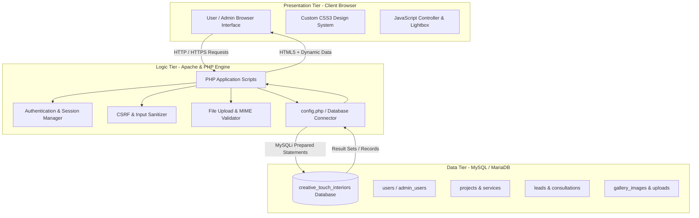
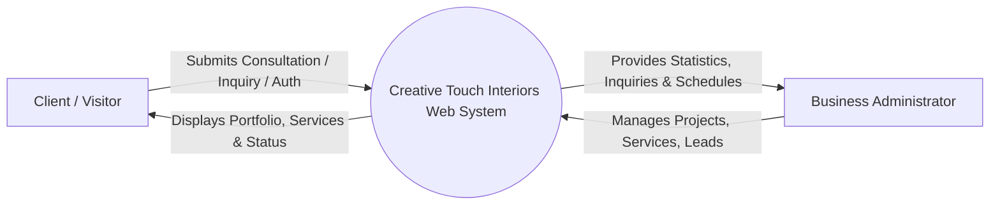
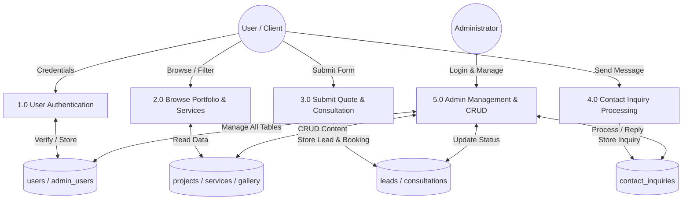

# Creative Touch Interiors — Project Documentation Report

---

# 1. COVER PAGE

```text
================================================================================
                           PROJECT REPORT ON
                       CREATIVE TOUCH INTERIORS
               (A Web-Based Interior Design Management System)
================================================================================

Submitted in partial fulfillment of the requirements for the award of the degree of
                   [BACHELOR OF COMPUTER APPLICATIONS / 
           BACHELOR OF SCIENCE IN INFORMATION TECHNOLOGY / 
            BACHELOR OF TECHNOLOGY IN COMPUTER ENGINEERING]

--------------------------------------------------------------------------------

SUBMITTED BY:
Name:                 [Student Name]
Enrollment / Roll No: [Enrollment / Roll Number]
Course / Department:  [Department of Computer Science & Information Technology]
Academic Year:        [2025 – 2026]

UNDER THE GUIDANCE OF:
Internal Guide:       [Prof. / Dr. Project Guide Name]
Designation:          [Assistant Professor / Associate Professor]

--------------------------------------------------------------------------------
                   [DEPARTMENT OF COMPUTER SCIENCE / IT]
                          [smt z.s patel / COLLEGE]
                              [VNSGU / SURAT]
                               [YEAR: 2026]
================================================================================
```

---

# 2. CERTIFICATE

```text
================================================================================
                      [NAME OF THE COLLEGE / INSTITUTE]
                   [Department of Computer Applications / IT]
                               [College Logo]

                                CERTIFICATE
================================================================================

This is to certify that the project entitled:

                        "CREATIVE TOUCH INTERIORS"

is a bonafide work carried out by:

                  Student Name:        [Student Name]
                  Enrollment / Roll No: [Enrollment / Roll Number]
                  Class / Semester:    [Semester / Year]

in partial fulfillment of the requirements for the award of the degree of [Course Name, e.g., Bachelor of Computer Applications / B.Tech Computer Engineering] from [Affiliated University Name] during the academic year [2025 - 2026].

The project report has been approved as satisfying the academic requirements prescribed for the project work.


_____________________          _____________________          _____________________
[Project Guide Name]           [Head of Department]           [External Examiner]
Internal Project Guide         Department of Computer Science  External Examiner
Date: _______________          Date: _______________          Date: _______________

College Seal / Stamp:
```

---

# 3. DECLARATION

```text
================================================================================
                                DECLARATION
================================================================================

I, [Student Name], student of [Course / Degree Name], Semester [Semester Number], holding Enrollment / Roll Number [Enrollment / Roll Number] at [College / Institute Name], hereby declare that the project entitled "CREATIVE TOUCH INTERIORS" is my original work.

This project was developed under the supervision and guidance of [Prof. / Dr. Project Guide Name], [Designation], [Department Name].

I further declare that this project work has not been previously submitted in part or in full to any other university or institution for the award of any degree, diploma, fellowship, or other similar title. All sources of information and tools utilized during the course of this work have been duly acknowledged.


Date:   [DD/MM/YYYY]
Place:  [City / Location]

                                                    ___________________________
                                                    [Student Name]
                                                    Roll No: [Enrollment Number]
```

---

# 4. ACKNOWLEDGEMENT

I express my deepest gratitude and sincere appreciation to my esteemed project guide, **[Prof. / Dr. Project Guide Name]**, for their invaluable guidance, constant encouragement, and constructive critique throughout the planning, design, and implementation stages of the project **“Creative Touch Interiors”**.

I also extend my heartfelt thanks to **[Head of Department Name]**, Head of the Department of [Department Name], and the respected Principal / Director **[Principal Name]** of **[College Name]**, for providing the computational resources, laboratory facilities, and an encouraging academic environment.

I would like to thank all the faculty members and technical staff of the department for their direct and indirect support during the development phase.

Lastly, I express my sincere love and gratitude to my family and fellow classmates for their unwavering support, moral encouragement, and valuable suggestions during the completion of this project report.

---

# 5. ABSTRACT

In modern architectural and lifestyle industries, the interior design sector plays a vital role in enhancing aesthetics, functional space utilization, and quality of life. However, traditional client-designer engagement methods suffer from geographic limitations, delayed quote estimation, fragmented communication channels, and insufficient visual transparency.

**Creative Touch Interiors** is a comprehensive, web-based interior design and client management system developed using **PHP**, **MySQL**, **HTML5**, **CSS3**, and **JavaScript**. The application bridges the gap between interior design professionals and clients by providing an interactive digital platform.

The system features two interconnected sub-systems:
1. **Client-Facing Web Application**: Enables prospective clients to explore architectural portfolios, browse categorized design galleries with lightbox capabilities, examine service tiers with transparent pricing indications, estimate project budgets, book consultation appointments, and manage profile requests securely.
2. **Executive Administrative Portal**: Provides an authenticated, role-based dashboard for interior design business managers. Administrators can manage project portfolios, oversee service offerings, track customer leads across the sales lifecycle (`new` $\rightarrow$ `contacted` $\rightarrow$ `qualified` $\rightarrow$ `converted`), manage scheduled consultations, review contact inquiries, and moderate system users.

Security mechanisms including **CSRF token verification**, **Bcrypt password hashing**, **parameterized SQL prepared statements**, and **strict file upload validation** are integrated throughout. The result is a robust, scalable, and responsive web solution that elevates brand visibility and optimizes operational workflows.

---

# 6. INTRODUCTION

### 6.1 Industry Background & Domain
Interior design is the art and science of understanding people's behavior to create functional, aesthetically pleasing spaces within a building structure. In recent years, rapid urbanization, rising disposable incomes, and the expansion of residential real estate and commercial offices have driven immense demand for professional interior design services.

Modern clients seek bespoke living rooms, ergonomic modular kitchens, luxury bedrooms, retail showrooms, corporate offices, and boutique cafes. Delivering these solutions requires clear visual presentation, structural transparency, organized planning, and seamless customer interaction.

### 6.2 Project Overview: Creative Touch Interiors
**Creative Touch Interiors** is an end-to-end web portal designed for an interior design and architectural practice. It functions as both a digital storefront and an operational management tool. The platform showcases high-resolution imagery of completed, in-progress, and planned projects, detailed service breakdowns across residential and commercial domains, and interactive customer inquiry modules.

### 6.3 Purpose & Motivation
The primary motivation behind developing Creative Touch Interiors is to eliminate communication bottlenecks and modernize the client acquisition cycle. By transforming manual consultation booking and offline catalog browsing into an accessible 24/7 web application, the business enhances client satisfaction, establishes professional credibility, and streamlines project inquiries directly to an administrative workspace.

---

# 7. PROBLEM STATEMENT

### 7.1 Problems in Traditional Interior Design Practices
1. **Inefficient Portfolio Presentation**: Physical brochures and printed photo albums are expensive to produce, difficult to distribute, and quickly become outdated when new projects are completed.
2. **Opaque Pricing & Unclear Scope**: Clients frequently struggle to understand baseline budget expectations for various room types, leading to mismatched expectations and wasted consultation time.
3. **Delayed Lead Capture & Misplaced Inquiries**: Traditional inquiries handled via casual phone calls or paper notebooks often get lost, resulting in uncontacted leads and lost business opportunities.
4. **Lack of Centralized Tracking for Consultations**: Scheduling on-site visits and architectural meetings through disjointed channels leads to double-booking and poor calendar visibility.
5. **Absence of a Customer Portal**: Clients lack a dedicated dashboard to track their submitted requirements, quote requests, and consultation status updates.

### 7.2 How Creative Touch Interiors Solves These Problems
* **Interactive Dynamic Showcase**: Categorized portfolio and gallery filtering (Residential, Commercial, Office, Retail) with high-definition imagery and responsive lightbox viewing.
* **Structured Consultation & Quote Engine**: A comprehensive multi-parameter form capturing property type, project scope, carpet area, budget range, and style preferences.
* **Centralized Admin Pipeline**: Inquiries and consultation requests are automatically recorded in a relational MySQL database and presented in an admin dashboard with status lifecycle management.
* **Registered User Workspace**: Clients can create accounts to track quote submissions, manage consultation dates, and update personal profiles.

---

# 8. OBJECTIVES

The core objectives of the **Creative Touch Interiors** project are:

1. **Digital Showcase & Brand Presence**: To provide an interactive, aesthetically refined digital portfolio exhibiting completed, ongoing, and conceptual interior design projects.
2. **Transparent Service Cataloging**: To categorize and describe diverse interior design offerings (Residential, Commercial, Office, Retail, 3D Visualization) with clear price-range benchmarks.
3. **Structured Lead Generation**: To capture detailed customer inquiries through an online quotation and consultation workflow.
4. **Appointment & Consultation Management**: To allow customers to schedule formal design consultations and enable management to confirm, complete, or reschedule them.
5. **Secure Administrative Governance**: To provide business administrators with tools to add, edit, delete, and monitor projects, gallery images, services, leads, and customer inquiries.
6. **Data Integrity & Security**: To implement defensive programming practices against common web vulnerabilities (SQL Injection, XSS, CSRF, and unauthorized access).

---

# 9. SCOPE OF THE PROJECT

### 9.1 In-Scope Capabilities
* **Public Information Portal**: Informational pages including Home, About Us (company history, core philosophy, team profiles), Services Catalog, Projects Portfolio, Categorized Gallery, and Contact details.
* **Project Filtering & Detail Views**: Filter projects by domain (`residential`, `commercial`, `office`, `retail`) and view dedicated project detail pages showing area, location, completion date, budget, and design style.
* **Interactive Gallery**: Filterable visual showcase with client-side image modal / lightbox.
* **Online Quote & Consultation Booking**: Form capturing property area, budget band, style preferences, target start dates, and custom notes.
* **User Authentication & Profile Module**: User registration, login, profile info management, profile picture upload/removal with MIME validation, and secure password updates.
* **Role-Based Admin Management**:
  * Dashboard with statistical summaries (total projects, active leads, pending consultations, users).
  * Lead pipeline management (`new`, `contacted`, `qualified`, `converted`, `lost`).
  * Consultation schedule status tracking (`pending`, `confirmed`, `completed`, `cancelled`).
  * Contact inquiry management (`new`, `read`, `replied`, `closed`).
  * CRUD operations on Projects, Services, and Gallery images.
  * User account administration.

### 9.2 Limitations & Out-of-Scope (Existing Version)
* Payment gateway integration for online milestone billing is not present in the current release.
* Automated SMS/WhatsApp API messaging gateway is not implemented.
* Real-time 3D web canvas (WebGL / Three.js) room customization is planned for future releases.

---

# 10. EXISTING SYSTEM VS. PROPOSED SYSTEM

### 10.1 Existing System Analysis
In the conventional business workflow, an interior design studio relies on physical studio visits, word-of-mouth referrals, printed paper brochures, and phone-based appointment books.

#### Limitations of Existing System:
* **Constrained Reach**: Limited to local walk-in clients.
* **Manual Record Keeping**: Paper registers and spreadsheet files risk data corruption and duplication.
* **High Operational Overhead**: Printing and mailing updated brochures requires recurring expenditure.
* **Inconvenient for Customers**: Requires manual follow-ups without status visibility.

### 10.2 Proposed System (Creative Touch Interiors)
The proposed web application replaces paper-bound workflows with a centralized web portal accessible from any desktop or mobile device.

| Feature / Metric | Existing System (Traditional) | Proposed System (Creative Touch Interiors) |
| :--- | :--- | :--- |
| **Portfolio Access** | Physical albums / studio visits | 24/7 online access with categorized filters |
| **Inquiry Logging** | Paper notebooks / manual notes | Automated MySQL relational storage |
| **Lead Tracking** | Difficult; prone to lost contacts | Interactive admin dashboard with status lifecycle |
| **Consultation Scheduling** | Phone calls & manual diary | Structured web form with instant admin logging |
| **Security & Auditing** | No digital access control | Role-based authentication (`super_admin`, `admin`, `user`) |
| **Device Accessibility** | None (Physical media) | 100% responsive across desktop, tablet, and mobile |

---

# 11. SYSTEM REQUIREMENTS

### 11.1 Hardware Requirements
#### Development & Server Machine:
* **Processor**: Intel Core i3 / AMD Ryzen 3 or higher (2.0 GHz+)
* **RAM**: 4 GB minimum (8 GB recommended)
* **Storage**: 500 MB free hard disk space for codebase, media assets, and database
* **Display**: $1366 \times 768$ minimum screen resolution ($1920 \times 1080$ recommended)

#### Client / End-User Machine:
* Any standard PC, laptop, tablet, or smartphone with internet connectivity and a modern web browser.

### 11.2 Software Requirements
* **Operating System**: Microsoft Windows 10 / 11, macOS, or Linux
* **Web Server**: Apache HTTP Server (Version 2.4+)
* **Database Server**: MySQL Server 5.7+ / MariaDB 10.4+
* **Backend Runtime**: PHP 7.4+ / PHP 8.0+ / PHP 8.2+
* **Web Browsers**: Google Chrome (v90+), Mozilla Firefox (v88+), Apple Safari (v14+), Microsoft Edge (v90+)
* **Development IDE**: Visual Studio Code / Sublime Text / PHPStorm
* **Local Server Stack**: XAMPP / WampServer / LAMP stack

---

# 12. TECHNOLOGY STACK

```text
+-------------------------------------------------------------------------+
|                         CREATIVE TOUCH INTERIORS                        |
+-------------------------------------------------------------------------+
|  Frontend Layer   : HTML5, CSS3, JavaScript (Vanilla ES6+), Custom CSS  |
|  Backend Layer    : PHP 7.4+ / 8.0+ (Procedural + OOP mysqli)           |
|  Database Layer   : MySQL / MariaDB Relational Database                 |
|  Server & Tools   : Apache HTTP Server, XAMPP, phpMyAdmin, VS Code       |
+-------------------------------------------------------------------------+
```

### 12.1 Frontend Technologies
* **HTML5**: Provides semantic structure (`<header>`, `<nav>`, `<main>`, `<section>`, `<article>`, `<footer>`).
* **CSS3**: Implements custom design variables, responsive flexbox layouts, CSS grids, smooth transitions, glassmorphic header states, and custom UI components without heavy external framework bloat.
* **JavaScript (ES6+)**: Powers asynchronous user interactions, mobile navigation drawer toggles, dynamic category filtering for projects and gallery images, form validation, and image lightbox overlays.

### 12.2 Backend Technology
* **PHP (Hypertext Preprocessor)**: Serves as the core server-side scripting language. Handles request routing, session lifecycle management, business logic execution, cryptographic operations, file upload processing, and secure database communication.

### 12.3 Database Technology
* **MySQL / MariaDB**: Relational Database Management System (RDBMS) providing ACID-compliant data storage, table indexing, foreign key integrity, and relational joins.

---

# 13. SYSTEM DESIGN & ARCHITECTURE

### 13.1 System Architecture
The application adheres to a modular **3-Tier Web Architecture**:



---

### 13.2 Website Navigation Structure

```mermaid
graph TD
    HOME[Home Page - index.php]
    ABOUT[About Us - about.php]
    SERVICES[Services - services.php]
    PROJECTS[Projects Portfolio - projects.php]
    PROJ_DETAIL[Project Detail - project.php]
    GALLERY[Gallery - gallery.php]
    QUOTE[Get Quote / Consultation - consultation.php]
    CONTACT[Contact Us - contact.php]
    LOGIN[User Login - login.php]
    REGISTER[User Register - register.php]
    PROFILE[User Profile - profile.php]
    
    ADMIN_LOGIN[Admin Login - admin/login.php]
    ADMIN_DASH[Admin Dashboard - admin/dashboard.php]
    ADMIN_LEADS[Leads Management - admin/leads.php]
    ADMIN_CONSULT[Consultations - admin/consultations.php]
    ADMIN_INQ[Inquiries - admin/contact_inquiries.php]
    ADMIN_PROJ[Projects Admin - admin/projects.php]
    ADMIN_SERV[Services Admin - admin/services.php]
    ADMIN_GALLERY[Gallery Admin - admin/gallery.php]
    ADMIN_USERS[Users Admin - admin/users.php]

    HOME --> ABOUT
    HOME --> SERVICES
    HOME --> PROJECTS
    PROJECTS --> PROJ_DETAIL
    HOME --> GALLERY
    HOME --> QUOTE
    HOME --> CONTACT
    HOME --> LOGIN
    LOGIN --> REGISTER
    LOGIN --> PROFILE
    
    ADMIN_LOGIN --> ADMIN_DASH
    ADMIN_DASH --> ADMIN_LEADS
    ADMIN_DASH --> ADMIN_CONSULT
    ADMIN_DASH --> ADMIN_INQ
    ADMIN_DASH --> ADMIN_PROJ
    ADMIN_DASH --> ADMIN_SERV
    ADMIN_DASH --> ADMIN_GALLERY
    ADMIN_DASH --> ADMIN_USERS
```



---

### 13.3 Data Flow Diagram (DFD Level 0 & Level 1)

#### Level 0 DFD (Context Diagram)


#### Level 1 DFD


---

# 14. MAJOR MODULES & FEATURES

### 14.1 Public Client Modules

#### 1. Home Module (`index.php`)
* **Hero Banner**: High-impact architectural headline, call-to-action buttons for Consultation and Portfolio exploration.
* **Services Highlight**: Dynamic display of featured services with icons and scope summaries.
* **Featured Projects Grid**: Visual preview of top-tier residential and commercial design works.
* **Gallery Showcase**: Visual snapshot of interior designs.
* **Client Testimonials & Team**: Client reviews and leadership profiles.

#### 2. About Us Module (`about.php`)
* **Company Journey & Vision**: Historical background of Creative Touch Interiors since inception (2009).
* **Core Philosophy**: Design methodology focusing on spatial harmony, sustainable materials, and ergonomic precision.
* **Leadership & Design Team**: Profiles of principal architects and interior specialists.

#### 3. Services Catalog Module (`services.php`)
* **Categorized Offerings**: Residential, Office/Commercial, Retail, and 3D Visualization packages.
* **Pricing Estimates**: Transparent indicative price brackets (e.g., Modular Kitchen $\text{₹}2\text{L} - \text{₹}7\text{L}$, Villa Interiors $\text{₹}18\text{L} - \text{₹}45\text{L}$).
* **Service Workflow**: 4-step transparent design process (Consultation $\rightarrow$ 3D Concept $\rightarrow$ Material Selection $\rightarrow$ Turnkey Execution).

#### 4. Projects Portfolio Module (`projects.php` & `project.php`)
* **Category Filtering**: Live JavaScript and server-side filtering across Residential, Commercial, Office, and Retail categories.
* **Detailed Project View**: Single project page displaying location, total area (sq.ft.), completion date, budget, design style, and execution status.

#### 5. Gallery Module (`gallery.php`)
* **Categorized Visual Vault**: Living room, Bedroom, Modular Kitchen, Luxury Bathroom, and Executive Office photos.
* **Interactive Lightbox**: Fullscreen modal preview with keyboard navigation and image title indicators.

#### 6. Consultation & Quote Engine (`consultation.php`)
* **Login-Gated Protection**: Ensures verified user contact data.
* **Comprehensive Parameter Capture**: City, property type (Apartment, Villa, Penthouse, Office, Retail), scope of work, carpet area in sq.ft., budget range, design theme (Modern, Contemporary, Minimalist, Traditional, Industrial), and target start date.
* **Dual Database Dispatch**: Concurrently creates a sales record in `leads` and an appointment calendar entry in `consultations`.

#### 7. Contact Module (`contact.php`)
* Direct contact form, office address, interactive Google Map embed, direct phone line, and email links. Stores submissions in `contact_inquiries`.

#### 8. User Account & Profile Module (`login.php`, `register.php`, `profile.php`)
* **Registration & Login**: Secure credential authentication with password verification.
* **Profile Management**: Update name, phone, and upload/remove custom profile avatars with server-side validation.
* **Personal Inquiries Dashboard**: Real-time view of personal quote requests and scheduled consultation appointments.
* **Account Security**: Secure password update facility.

---

### 14.2 Administrative Modules (`/admin/`)

#### 1. Executive Dashboard (`admin/dashboard.php`)
* Metrics overview: Total Projects, Completed Projects, Active Services, Total Leads, New Leads, Contact Inquiries, Scheduled Consultations, and Registered Users.
* Fast-action quick tables showing newest leads and pending customer inquiries.

#### 2. Lead Management Pipeline (`admin/leads.php`)
* View, filter, edit, update status (`new`, `contacted`, `qualified`, `converted`, `lost`), and delete customer quote leads.

#### 3. Consultations Management (`admin/consultations.php`)
* Manage consultation appointments, adjust meeting dates/times, update progress status (`pending`, `confirmed`, `completed`, `cancelled`), and record internal meeting notes.

#### 4. Contact Inquiries Management (`admin/contact_inquiries.php`)
* Review customer inquiries, mark status (`new`, `read`, `replied`, `closed`), and archive resolved messages.

#### 5. Projects Management (`admin/projects.php`)
* Full CRUD (Create, Read, Update, Delete) for portfolio projects with cover image upload, slug generation, category assignment, budget formatting, and featured status toggles.

#### 6. Services Management (`admin/services.php`)
* Manage service titles, categories, pricing guidelines, emoji/custom icons, and featured flags.

#### 7. Gallery Management (`admin/gallery.php`)
* Upload, categorize, order, and remove portfolio gallery photos.

#### 8. User Management (`admin/users.php`)
* Monitor registered customer accounts and manage admin credentials with role enforcement (`super_admin` vs `admin`).

---

# 15. DATABASE DESIGN & SCHEMA

The database **`creative_touch_interiors`** is structured in Third Normal Form (3NF) to ensure data normalization, minimize redundancy, and maintain referential integrity.

### 15.1 Entity Relationship (ER) Diagram

```mermaid
erDiagram
    USERS ||--o{ LEADS : submits
    USERS ||--o{ CONSULTATIONS : books
    PROJECTS ||--o{ GALLERY_IMAGES : contains
    
    ADMIN_USERS {
        int id PK
        varchar username UK
        varchar password
        varchar name
        varchar email UK
        enum role "admin, super_admin"
        timestamp created_at
        timestamp updated_at
    }

    USERS {
        int id PK
        varchar name
        varchar email UK
        varchar password
        varchar phone
        varchar profile_picture
        tinyint terms_agreed
        timestamp terms_agreed_at
        timestamp created_at
    }

    PROJECTS {
        int id PK
        varchar title
        varchar slug UK
        text description
        varchar image
        enum category "residential, commercial, office, retail"
        varchar location
        varchar area
        varchar design_style
        date completion_date
        decimal budget
        enum status "completed, in_progress, planned"
        tinyint featured
        longtext images
        timestamp created_at
        timestamp updated_at
    }

    SERVICES {
        int id PK
        varchar title
        varchar slug UK
        text description
        varchar category
        varchar icon
        varchar price_range
        tinyint featured
        timestamp created_at
        timestamp updated_at
    }

    LEADS {
        int id PK
        varchar name
        varchar email
        varchar phone
        varchar city
        varchar property_type
        varchar project_type
        varchar area
        varchar budget
        varchar design_preference
        date expected_start_date
        text message
        enum status "new, contacted, qualified, converted, lost"
        timestamp created_at
        timestamp updated_at
    }

    CONSULTATIONS {
        int id PK
        varchar client_name
        varchar client_email
        varchar client_phone
        varchar subject
        date consultation_date
        time consultation_time
        enum status "pending, confirmed, completed, cancelled"
        text notes
        timestamp created_at
        timestamp updated_at
    }

    CONTACT_INQUIRIES {
        int id PK
        varchar name
        varchar email
        varchar phone
        varchar subject
        text message
        enum status "new, read, replied, closed"
        timestamp created_at
        timestamp updated_at
    }

    GALLERY_IMAGES {
        int id PK
        varchar title
        varchar image_path
        varchar category
        int project_id FK
        tinyint featured
        int order_index
        timestamp created_at
        timestamp updated_at
    }

    TESTIMONIALS {
        int id PK
        varchar client_name
        varchar client_photo
        varchar project_title
        int rating
        text testimonial
        tinyint featured
        enum status "pending, approved, rejected"
        timestamp created_at
        timestamp updated_at
    }

    TEAM_MEMBERS {
        int id PK
        varchar name
        varchar designation
        text bio
        varchar photo
        varchar email
        varchar linkedin
        int order_index
        enum status "active, inactive"
        timestamp created_at
        timestamp updated_at
    }

    WEBSITE_CONTENT {
        int id PK
        varchar section_key UK
        text content
        timestamp updated_at
    }
```



---

### 15.2 Detailed Database Table Dictionaries

#### 1. Table: `admin_users`
| Field | Type | Null | Key | Default | Description |
| :--- | :--- | :--- | :--- | :--- | :--- |
| `id` | INT(11) | NO | PRI | AUTO_INCREMENT | Unique admin identifier |
| `username` | VARCHAR(50) | NO | UNI | None | Unique login username |
| `password` | VARCHAR(255) | NO | | None | Bcrypt hashed password |
| `name` | VARCHAR(100) | NO | | None | Full name of administrator |
| `email` | VARCHAR(100) | NO | UNI | None | Unique email address |
| `role` | ENUM('admin','super_admin') | YES | | 'admin' | Access privilege level |
| `created_at` | TIMESTAMP | NO | | CURRENT_TIMESTAMP | Record creation timestamp |
| `updated_at` | TIMESTAMP | NO | | CURRENT_TIMESTAMP | Auto-updating timestamp |

#### 2. Table: `users`
| Field | Type | Null | Key | Default | Description |
| :--- | :--- | :--- | :--- | :--- | :--- |
| `id` | INT(11) | NO | PRI | AUTO_INCREMENT | Unique user identifier |
| `name` | VARCHAR(100) | NO | | None | Full name of client |
| `email` | VARCHAR(100) | NO | UNI | None | Unique email for login |
| `password` | VARCHAR(255) | NO | | None | Securely hashed password |
| `phone` | VARCHAR(20) | YES | | NULL | Contact phone number |
| `profile_picture`| VARCHAR(255) | YES | | NULL | Filename of uploaded avatar |
| `terms_agreed` | TINYINT(1) | NO | | 0 | Terms & Conditions acceptance flag (1/0) |
| `terms_agreed_at`| TIMESTAMP | YES | | NULL | Date/time when terms were accepted |
| `created_at` | TIMESTAMP | NO | | CURRENT_TIMESTAMP | Account creation time |

#### 3. Table: `projects`
| Field | Type | Null | Key | Default | Description |
| :--- | :--- | :--- | :--- | :--- | :--- |
| `id` | INT(11) | NO | PRI | AUTO_INCREMENT | Unique project identifier |
| `title` | VARCHAR(255) | NO | | None | Project name / title |
| `slug` | VARCHAR(255) | NO | UNI | None | URL-safe slug |
| `description` | TEXT | YES | | NULL | Detailed architectural summary |
| `image` | VARCHAR(255) | YES | | NULL | Cover image path |
| `category` | ENUM('residential','commercial','office','retail') | NO | | None | Domain classification |
| `location` | VARCHAR(255) | YES | | NULL | Project geographical location |
| `area` | VARCHAR(50) | YES | | NULL | Built-up area (e.g., '2,400 sq.ft') |
| `design_style` | VARCHAR(100) | YES | | NULL | Style (Modern, Scandinavian, etc.) |
| `completion_date`| DATE | YES | | NULL | Project completion date |
| `budget` | DECIMAL(15,2)| YES | | NULL | Project budget in INR |
| `status` | ENUM('completed','in_progress','planned') | YES | | 'planned' | Lifecycle status |
| `featured` | TINYINT(1) | YES | | 0 | Homepage highlight flag (1/0) |
| `images` | LONGTEXT (JSON)| YES | | NULL | Supplementary image paths |
| `created_at` | TIMESTAMP | NO | | CURRENT_TIMESTAMP | Insertion timestamp |

#### 4. Table: `services`
| Field | Type | Null | Key | Default | Description |
| :--- | :--- | :--- | :--- | :--- | :--- |
| `id` | INT(11) | NO | PRI | AUTO_INCREMENT | Unique service ID |
| `title` | VARCHAR(255) | NO | | None | Service name |
| `slug` | VARCHAR(255) | NO | UNI | None | URL slug |
| `description` | TEXT | YES | | NULL | Detailed service description |
| `category` | VARCHAR(100) | YES | | NULL | Service domain category |
| `icon` | VARCHAR(50) | YES | | NULL | Graphical icon / emoji symbol |
| `price_range` | VARCHAR(100) | YES | | NULL | Estimated price bracket |
| `featured` | TINYINT(1) | YES | | 0 | Featured service flag |

#### 5. Table: `leads`
| Field | Type | Null | Key | Default | Description |
| :--- | :--- | :--- | :--- | :--- | :--- |
| `id` | INT(11) | NO | PRI | AUTO_INCREMENT | Unique lead ID |
| `name` | VARCHAR(100) | NO | | None | Inquiring customer name |
| `email` | VARCHAR(100) | NO | | None | Customer email |
| `phone` | VARCHAR(20) | YES | | NULL | Contact phone number |
| `city` | VARCHAR(100) | YES | | NULL | Project location city |
| `property_type` | VARCHAR(100) | YES | | NULL | Type (Apartment, Villa, Office, etc.) |
| `project_type` | VARCHAR(100) | YES | | NULL | Scope (Full Home, Kitchen, etc.) |
| `area` | VARCHAR(50) | YES | | NULL | Floor space in sq.ft |
| `budget` | VARCHAR(50) | YES | | NULL | Budget bracket |
| `design_preference`| VARCHAR(100)| YES | | NULL | Aesthetic preference |
| `expected_start_date`| DATE | YES | | NULL | Desired commencement date |
| `message` | TEXT | YES | | NULL | Custom specifications |
| `status` | ENUM('new','contacted','qualified','converted','lost') | YES | | 'new' | Lead pipeline state |

#### 6. Table: `consultations`
| Field | Type | Null | Key | Default | Description |
| :--- | :--- | :--- | :--- | :--- | :--- |
| `id` | INT(11) | NO | PRI | AUTO_INCREMENT | Consultation ID |
| `client_name` | VARCHAR(100) | NO | | None | Client full name |
| `client_email` | VARCHAR(100) | NO | | None | Client email |
| `client_phone` | VARCHAR(20) | YES | | NULL | Client contact number |
| `subject` | VARCHAR(255) | YES | | 'General Consultation' | Meeting subject |
| `consultation_date`| DATE | NO | | None | Scheduled meeting date |
| `consultation_time`| TIME | NO | | None | Scheduled meeting time |
| `status` | ENUM('pending','confirmed','completed','cancelled') | YES | | 'pending' | Booking status |
| `notes` | TEXT | YES | | NULL | Meeting & project notes |

#### 7. Table: `contact_inquiries`
| Field | Type | Null | Key | Default | Description |
| :--- | :--- | :--- | :--- | :--- | :--- |
| `id` | INT(11) | NO | PRI | AUTO_INCREMENT | Unique inquiry identifier |
| `name` | VARCHAR(100) | NO | | None | Sender name |
| `email` | VARCHAR(100) | NO | | None | Sender email |
| `phone` | VARCHAR(20) | YES | | NULL | Contact number |
| `subject` | VARCHAR(255) | NO | | None | Inquiry topic |
| `message` | TEXT | NO | | None | Inquiring message text |
| `status` | ENUM('new','read','replied','closed') | YES | | 'new' | Processing status |

#### 8. Table: `gallery_images`
| Field | Type | Null | Key | Default | Description |
| :--- | :--- | :--- | :--- | :--- | :--- |
| `id` | INT(11) | NO | PRI | AUTO_INCREMENT | Unique image identifier |
| `title` | VARCHAR(255) | NO | | None | Descriptive image caption |
| `image_path` | VARCHAR(255) | NO | | None | File path on disk |
| `category` | VARCHAR(100) | YES | | NULL | Category (`living_room`, `kitchen`, etc.) |
| `project_id` | INT(11) | YES | MUL | NULL | Foreign Key $\rightarrow$ `projects(id)` |
| `featured` | TINYINT(1) | YES | | 0 | Highlight on homepage flag |
| `order_index` | INT(11) | YES | | 0 | Display sequence order |

---

# 16. USER INTERFACE DESIGN

### 16.1 Design Philosophy & Aesthetics
The UI for **Creative Touch Interiors** embodies architectural elegance, clarity, and visual balance. It utilizes:
* **Color Palette**:
  * *Primary Slate / Charcoal*: `#1e293b` & `#0f172a` (representing structural stability and luxury).
  * *Accent Royal Blue*: `#2563eb` & `#1d4ed8` (guiding call-to-action interactions).
  * *Neutral Backgrounds*: `#ffffff` & `#f8fafc` (offering clean whitespace for interior photography).
  * *Status Indicators*: Green (`#10b981`) for completed/confirmed, Amber (`#f59e0b`) for pending/in-progress, and Slate (`#64748b`) for planned.
* **Typography**: Clean, sans-serif font stack (`Inter`, `system-ui`, `-apple-system`, `sans-serif`) ensuring high legibility across high-DPI displays.
* **Responsive Layouts**: Flexible grid configurations (`.grid-2`, `.grid-3`, `.grid-4`) adapting seamlessly across mobile viewports ($<768\text{px}$) and desktop displays ($>1024\text{px}$).

---

# 17. IMPLEMENTATION DETAILS & CODE HIGHLIGHTS

### 17.1 Database Connection & Helper Utilities (`includes/config.php`)
```php
<?php
// Database Configuration
define('DB_HOST', 'localhost');
define('DB_USER', 'root');
define('DB_PASS', '');
define('DB_NAME', 'creative_touch_interiors');

// Initialize Connection
$conn = new mysqli(DB_HOST, DB_USER, DB_PASS, DB_NAME);
if ($conn->connect_error) {
    die("Database Connection failed: " . $conn->connect_error);
}
$conn->set_charset("utf8mb4");

// Input Sanitization
function sanitize($data) {
    global $conn;
    $data = trim($data);
    $data = stripslashes($data);
    $data = htmlspecialchars($data);
    return $conn->real_escape_string($data);
}

// CSRF Security Protection
function csrf_token() {
    if (empty($_SESSION['csrf_token'])) {
        $_SESSION['csrf_token'] = bin2hex(random_bytes(32));
    }
    return $_SESSION['csrf_token'];
}

function validate_csrf() {
    if ($_SERVER['REQUEST_METHOD'] === 'POST') {
        if (!isset($_POST['csrf_token']) || !hash_equals($_SESSION['csrf_token'] ?? '', $_POST['csrf_token'])) {
            return false;
        }
    }
    return true;
}
?>
```

### 17.2 Secure User Authentication with Prepared Statements (`login.php`)
```php
if ($_SERVER['REQUEST_METHOD'] == 'POST') {
    if (!validate_csrf()) {
        $error = 'Security token mismatch. Please reload and try again.';
    } else {
        $email = sanitize($_POST['email'] ?? '');
        $password = $_POST['password'] ?? '';
        
        $sql = "SELECT * FROM users WHERE email = ?";
        $stmt = $conn->prepare($sql);
        $stmt->bind_param("s", $email);
        $stmt->execute();
        $result = $stmt->get_result();
        $user = $result->fetch_assoc();
        
        if ($user && password_verify($password, $user['password'])) {
            $_SESSION['user_id'] = $user['id'];
            $_SESSION['user_name'] = $user['name'];
            $_SESSION['user_email'] = $user['email'];
            header("Location: profile.php");
            exit();
        } else {
            $error = "Invalid email or password.";
        }
    }
}
```

### 17.3 Secure Consultation & Quote Dispatch (`consultation.php`)
```php
$sql = "INSERT INTO leads (name, email, phone, city, property_type, project_type, area, budget, design_preference, expected_start_date, message, status) 
        VALUES (?, ?, ?, ?, ?, ?, ?, ?, ?, ?, ?, 'new')";
$stmt = $conn->prepare($sql);
$stmt->bind_param("sssssssssss", $name, $email, $phone, $city, $property_type, $project_type, $area, $budget, $design_preference, $expected_start_date, $message);
$stmt->execute();
```

---

# 18. SCREENSHOTS & USER INTERFACE PLACEHOLDERS

**Figure 1: Home Page Hero Section & Featured Showcase**
```text
+-------------------------------------------------------------------------+
| [Insert Screenshot: Home Page (index.php) Hero Section & Navigation Bar]|
+-------------------------------------------------------------------------+
```

**Figure 2: About Us Page & Design Philosophy**
```text
+-------------------------------------------------------------------------+
| [Insert Screenshot: About Us Page (about.php) & Team Profiles]          |
+-------------------------------------------------------------------------+
```

**Figure 3: Services Catalog with Pricing Tiers**
```text
+-------------------------------------------------------------------------+
| [Insert Screenshot: Services Page (services.php) Grid & Scope Cards]    |
+-------------------------------------------------------------------------+
```

**Figure 4: Portfolio Projects Showcase with Live Category Filter**
```text
+-------------------------------------------------------------------------+
| [Insert Screenshot: Projects Portfolio Page (projects.php)]            |
+-------------------------------------------------------------------------+
```

**Figure 5: Individual Project Detail View**
```text
+-------------------------------------------------------------------------+
| [Insert Screenshot: Project Detail Page (project.php) Specifications]   |
+-------------------------------------------------------------------------+
```

**Figure 6: Categorized Interior Gallery with Lightbox View**
```text
+-------------------------------------------------------------------------+
| [Insert Screenshot: Gallery Page (gallery.php) & Active Lightbox Modal] |
+-------------------------------------------------------------------------+
```

**Figure 7: Consultation & Design Quote Request Form**
```text
+-------------------------------------------------------------------------+
| [Insert Screenshot: Consultation Request Page (consultation.php)]      |
+-------------------------------------------------------------------------+
```

**Figure 8: Customer Profile & Inquiries History Dashboard**
```text
+-------------------------------------------------------------------------+
| [Insert Screenshot: User Profile Workspace (profile.php)]               |
+-------------------------------------------------------------------------+
```

**Figure 9: Executive Admin Overview Dashboard**
```text
+-------------------------------------------------------------------------+
| [Insert Screenshot: Admin Dashboard (admin/dashboard.php) with Metrics] |
+-------------------------------------------------------------------------+
```

**Figure 10: Admin Leads & Pipeline Management**
```text
+-------------------------------------------------------------------------+
| [Insert Screenshot: Admin Leads Workspace (admin/leads.php)]            |
+-------------------------------------------------------------------------+
```

---

# 19. TESTING & QUALITY ASSURANCE

### 19.1 Testing Methodology
The application underwent rigorous **Black-Box Testing**, **Integration Testing**, and **Security Auditing** across all public and administrative modules.

### 19.2 Test Cases & Results Matrix

| Test ID | Test Scenario | Test Steps / Input | Expected Result | Actual Result | Status |
| :--- | :--- | :--- | :--- | :--- | :--- |
| **TC01** | User Registration | Submit registration form with valid name, email, phone, password, and agreed Terms checkbox | User record created in `users` table with terms timestamp; redirects | User registered successfully | **PASS** |
| **TC01b**| Terms Agreement Validation | Submit registration form without checking Terms & Conditions box | Registration rejected; displays 'Please agree to the Terms & Conditions and Privacy Policy before creating your account.' | Blocked on frontend & backend; no account created | **PASS** |
| **TC02** | Duplicate User Prevention | Register with an already existing email address | System catches duplicate email and displays error alert | Error displayed: "Email already registered" | **PASS** |
| **TC03** | User Authentication | Enter registered email and valid password | User session initiated; redirects to `profile.php` | Successfully logged in | **PASS** |
| **TC04** | Invalid Password Attempt | Enter valid email with incorrect password | Access denied; displays "Invalid email or password" | Access denied | **PASS** |
| **TC05** | CSRF Token Validation | Submit POST request with missing or altered CSRF token | Request rejected with security error | Request rejected; data protected | **PASS** |
| **TC06** | Project Category Filter | Click "Commercial" filter tab on `projects.php` | Display only projects where category = 'commercial' | Filtered accurately without full reload | **PASS** |
| **TC07** | Gallery Lightbox Modal | Click on a gallery image card | Modal opens showing enlarged image and caption | Modal renders properly | **PASS** |
| **TC08** | Consultation Submission | Fill quote form (city, property type, budget, style) | Lead recorded in `leads` and consultation in `consultations` | Records inserted; success banner displayed | **PASS** |
| **TC09** | Mandatory Field Validation | Submit consultation form leaving required fields empty | Form halts submission; highlights missing fields | Validation error displayed | **PASS** |
| **TC10** | Avatar Upload Security | Attempt uploading a `.php` script disguised as an image | Upload rejected due to MIME and extension check | Upload blocked; error displayed | **PASS** |
| **TC11** | Admin Authentication | Enter admin credentials on `admin/login.php` | Admin session initialized; redirects to `admin/dashboard.php`| Admin dashboard loads | **PASS** |
| **TC12** | Lead Status Update | Change lead status from 'new' to 'contacted' in admin | Status field updated in `leads` table and UI reflects badge | Updated immediately | **PASS** |
| **TC13** | Mobile Viewport Layout | View site on mobile screen width (375px) | Hamburger navigation toggles; grid cards stack vertically | Responsive layout adapts properly | **PASS** |

---

# 20. ADVANTAGES OF THE SYSTEM

1. **24/7 Digital Accessibility**: Clients can discover designs, evaluate pricing tiers, and submit quotation requests at any time from any device.
2. **Streamlined Lead Conversion**: Captures comprehensive client parameters (area, style, budget, location) upfront, shortening the initial sales discussion.
3. **Structured Back-Office Management**: Centralizes leads, appointments, inquiries, and media assets in a unified administrative interface.
4. **Strong Security Foundation**: Protects user passwords with Bcrypt hashing, guards state-changing forms with CSRF tokens, and immunizes against SQL Injection with prepared statements.
5. **Fast Load Times & Lightweight Footprint**: Built with clean native PHP and Vanilla CSS/JS without heavy runtime frameworks, ensuring rapid page loads and minimal server resource overhead.

---

# 21. LIMITATIONS

1. **Absence of Real-Time Payment Gateway**: The current version does not support online payment of token consultation fees or milestone invoicing.
2. **Manual Email Dispatch**: Relies on internal database notifications rather than an automated transactional SMTP email/SMS service.
3. **No 3D In-Browser Interactive Canvas**: 3D design packages are displayed as high-resolution renders rather than interactive WebGL models.
4. **Single-Currency Presentation**: Pricing structures are modeled primarily in Indian Rupees (INR - ₹).

---

# 22. FUTURE ENHANCEMENTS

1. **Integrated Payment Gateway**: Integration with Razorpay, Stripe, or PayPal for digital consultation booking deposits and stage-wise project billing.
2. **Automated WhatsApp & SMS Notifications**: Instant dispatch of booking confirmations and lead follow-up alerts via WhatsApp Cloud API / Twilio.
3. **Interactive 3D Virtual Room Planner**: Browser-based 3D spatial customizer allowing clients to preview wall colors, wood textures, and furniture arrangements in real time.
4. **Multi-Branch & Designer Assignment**: Capability to assign incoming leads to specific architects or local branch design teams based on city and domain specialization.
5. **Client Milestone Tracking Portal**: Dedicated timeline tracker where clients can view construction progress, architectural CAD drawings, and site photo updates.

---

# 23. CONCLUSION

The **Creative Touch Interiors** web application successfully accomplishes all defined objectives by delivering an elegant, feature-rich, and secure digital platform for an interior design enterprise.

By combining an intuitive client-facing portal with an efficient administrative control suite, the system addresses the limitations of traditional manual operations. The architecture ensures high performance, data integrity, and cross-device responsiveness while maintaining strict security standards. The system serves as a solid foundation that can be expanded with future enhancements such as payment integration and interactive 3D visualizations.

---

# 24. BIBLIOGRAPHY & REFERENCES

### 24.1 Books & Publications
1. Welling, L., & Thomson, L. (2016). *PHP and MySQL Web Development* (5th ed.). Addison-Wesley Professional.
2. Nixon, R. (2021). *Learning PHP, MySQL & JavaScript: With jQuery, CSS & HTML5* (6th ed.). O'Reilly Media.
3. Duckett, J. (2014). *JavaScript and JQuery: Interactive Front-End Web Development*. Wiley.
4. Keith, J., & Sambells, J. (2010). *DOM Scripting: Web Design with JavaScript and the Document Object Model*. Friends of ED.

### 24.2 Web Documentation & Official Manuals
1. **PHP Official Documentation**: [https://www.php.net/manual/en/](https://www.php.net/manual/en/)
2. **MySQL Reference Manual**: [https://dev.mysql.com/doc/](https://dev.mysql.com/doc/)
3. **MDN Web Docs (Mozilla Developer Network)**: [https://developer.mozilla.org/](https://developer.mozilla.org/)
4. **W3C Web Standards & Guidelines**: [https://www.w3.org/](https://www.w3.org/)
5. **OWASP Top 10 Security Practices**: [https://owasp.org/www-project-top-ten/](https://owasp.org/www-project-top-ten/)
